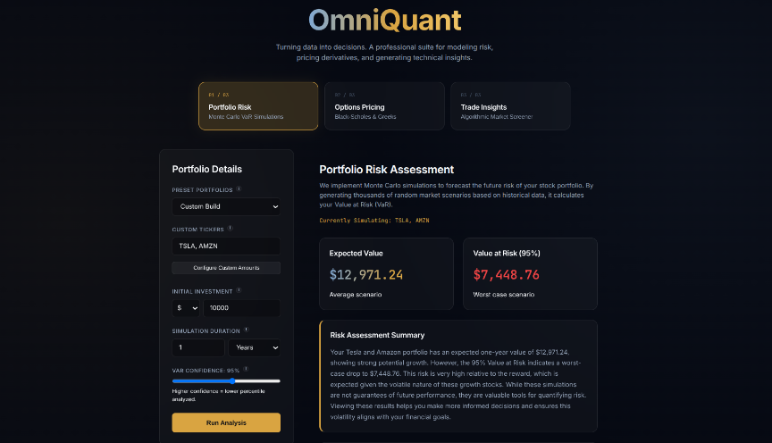
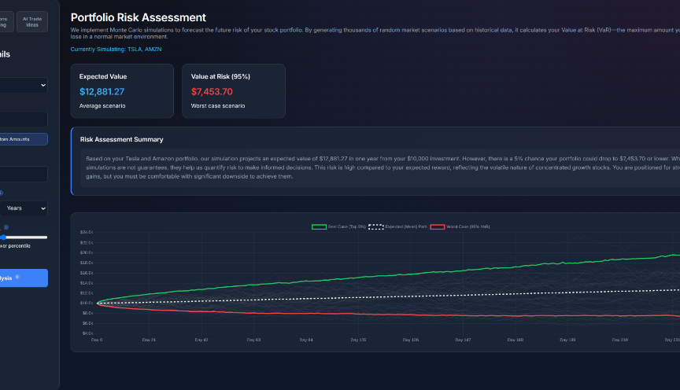
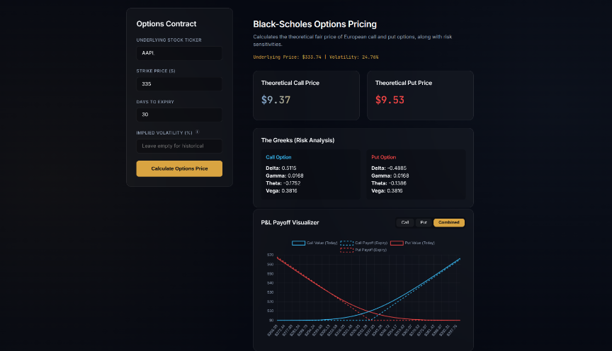
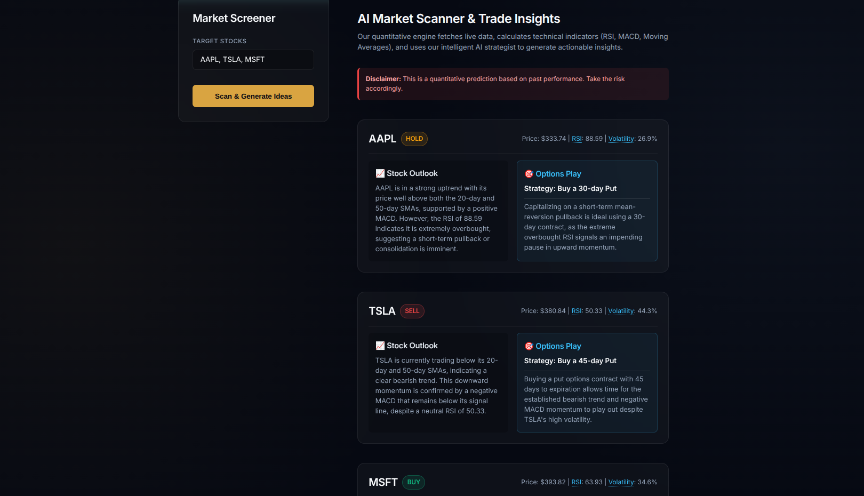

# OmniQuant 📈

**Turning data into decisions.** A professional quantitative suite for modeling risk, pricing derivatives, and generating technical insights. 

🚀 **Live Demo:** [https://omniquant-7h4n.onrender.com/](https://omniquant-7h4n.onrender.com/)

---

## 📸 Interface Preview






## ✨ Core Features

### 1. Portfolio Risk Assessment
Implements advanced **Monte Carlo Value at Risk (VaR)** simulations to forecast future risk. By generating thousands of random market scenarios based on historical equity data, OmniQuant quantifies your maximum expected loss within a specified confidence interval (e.g., 95%). 

### 2. Options Pricing Engine
Utilizes the standard **Black-Scholes model** to calculate the theoretical fair price of European call and put options. It seamlessly models and plots risk sensitivities (The Greeks: Delta, Gamma, Theta, Vega) alongside dynamic interactive P&L payoff visualizers.

### 3. AI Market Scanner & Trade Insights
An algorithmic screener that fetches live, localized market data and computes foundational technical indicators (such as RSI, MACD, and Moving Averages). It feeds these quantitative metrics into an intelligent AI strategist (powered by Groq/LLM) to generate robust, actionable trade setups and options plays.

## 🛠 Tech Stack

- **Backend:** Python, FastAPI, NumPy, Pandas, SciPy, yfinance
- **AI Integration:** Groq API / Google Generative AI
- **Frontend:** Vanilla JS, CSS3 (CSS Grid, Glassmorphism design), HTML5
- **Deployment:** Render (Python 3.11 Environment)

## 💻 Local Setup

1. **Clone the repository:**
   ```bash
   git clone https://github.com/KD-joshi/OmniQuant.git
   cd OmniQuant
   ```

2. **Create a virtual environment and install dependencies:**
   ```bash
   python3 -m venv venv
   source venv/bin/activate
   pip install -r backend/requirements.txt
   ```

3. **Configure Environment Variables:**
   Create a `.env` file in the root directory and add your API keys:
   ```env
   GROQ_API_KEY=your_api_key_here
   GEMINI_API_KEY=your_api_key_here
   ```

4. **Run the FastAPI server:**
   ```bash
   uvicorn backend.main:app --reload --port 8001
   ```
   Navigate to `http://localhost:8001` in your browser.

## 🌐 Deployment (Render)

This application is configured for seamless deployment on Render:
- **Build Command:** `pip install -r backend/requirements.txt`
- **Start Command:** `uvicorn backend.main:app --host 0.0.0.0 --port $PORT`
- **Python Version:** Forced to `3.11.4` via `.python-version` to ensure wheel compatibility for data science packages.

---
*Disclaimer: This is a quantitative prediction tool based on past performance and theoretical models. Trade at your own risk.*
